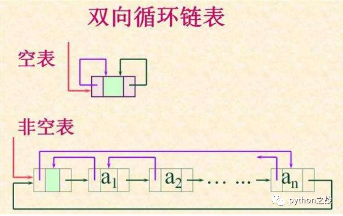
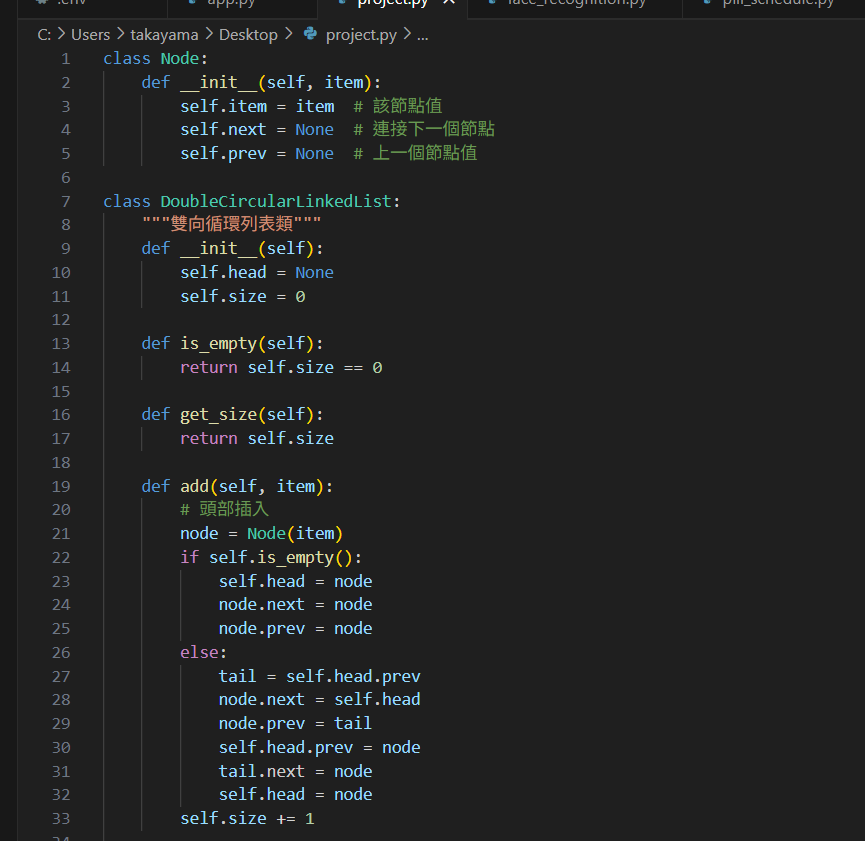
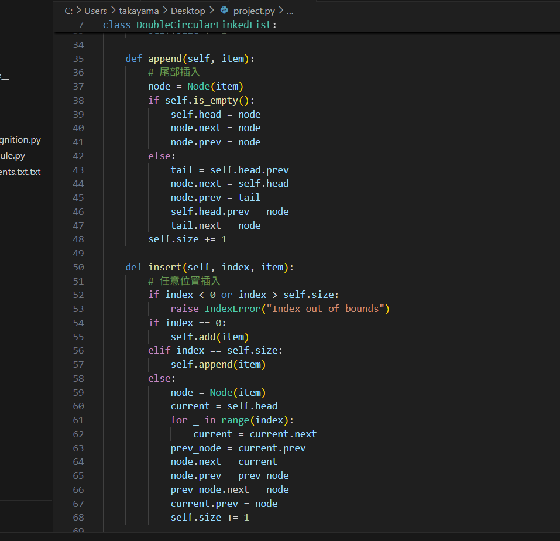
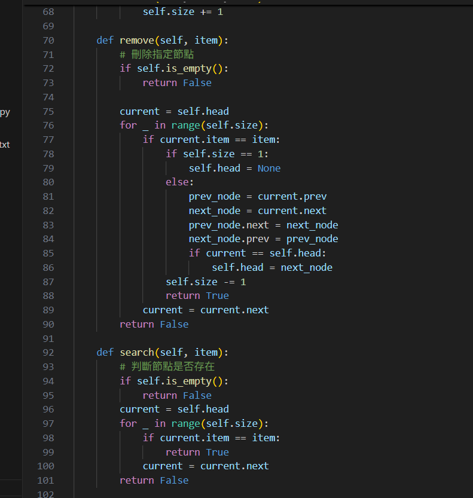
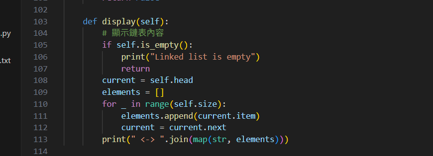
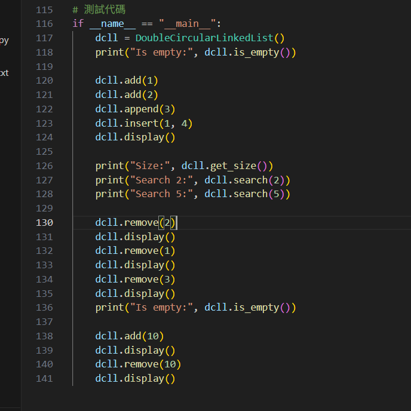

# project

11124231 蔡雅婷、11124134 翁語鮮

# 概述：

雙向循環鏈表是在雙向鏈表的基礎上發展的，雙向鏈表的最後一個節點指向起始節點，起始節點的上一個節點指向最後一個節點，就得到雙向循環鏈表。
雙向循環鏈表比雙向鏈表具有更多的優勢，節點的增加和刪除有很多優化的地方，從起點開始不必循環完整個鏈表就可以增加或刪除節點。

 

只以基本的思路實現基本的方法，對於雙向循環鏈表而言還有很多可以優化的地方，正向遍歷和逆向遍歷獲得結果的時間是不一樣的。

# 具體代碼
鏈表類的操作有幾個核心的地方：第一個是判斷是否為最後一個節點，通過鏈表的相關特性，如單向鏈表最後一個節點的next屬性為None、單向循環鏈表的最後一個節點的next屬性等於頭部節點；第二個是使用游標來替代節點指向，這個在操作節點的時候有時還需要兩個游標，但是對於雙向節點而言只需要一個游標，通過當前節點的屬性可以找到上下節點。

# 主程式執行區塊

    
# 執行結果

