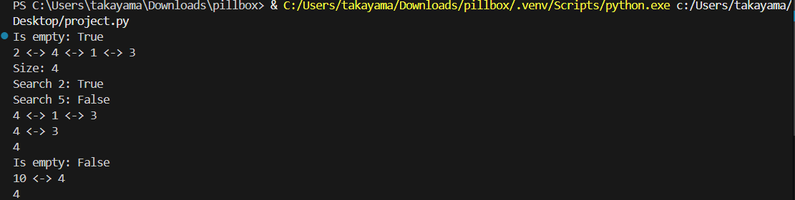

# project
11124231 蔡雅婷、11124134 翁語鮮
# 概述：
雙向循環鏈表是在雙向鏈表的基礎上發展的，雙向鏈表的最後一個節點指向起始節點，起始節點的上一個節點指向最後一個節點，就得到雙向循環鏈表。

由圖可知，單向循環鍊錶的判斷條件不再是表為空了，而變成了是否到表頭。

# 操作
is_empty()判斷鍊錶是否為空
length()返回鍊錶的長度
travel()遍歷
add(item)在頭部添加一個節點
append(item)在尾部添加一個節點
insert(pos, item)在指定位置pos添加節點
remove(item)刪除一個節點
search(item)查找節點是否存在

# 具體代碼

class Node:
    def __init__(self, item):
        self.item = item  # 該節點值
        self.next = None  # 連接下一個節點
        self.prev = None  # 上一個節點值

class DoubleCircularLinkedList:
    """雙向循環列表類"""
    def __init__(self):
        self.head = None
        self.size = 0

    def is_empty(self):
        return self.size == 0

    def get_size(self):
        return self.size

    def add(self, item):
        # 頭部插入
        node = Node(item)
        if self.is_empty():
            self.head = node
            node.next = node
            node.prev = node
        else:
            tail = self.head.prev
            node.next = self.head
            node.prev = tail
            self.head.prev = node
            tail.next = node
            self.head = node
        self.size += 1

    def append(self, item):
        # 尾部插入
        node = Node(item)
        if self.is_empty():
            self.head = node
            node.next = node
            node.prev = node
        else:
            tail = self.head.prev
            node.next = self.head
            node.prev = tail
            self.head.prev = node
            tail.next = node
        self.size += 1

    def insert(self, index, item):
        # 任意位置插入
        if index < 0 or index > self.size:
            raise IndexError("Index out of bounds")
        if index == 0:
            self.add(item)
        elif index == self.size:
            self.append(item)
        else:
            node = Node(item)
            current = self.head
            for _ in range(index):
                current = current.next
            prev_node = current.prev
            node.next = current
            node.prev = prev_node
            prev_node.next = node
            current.prev = node
            self.size += 1

    def remove(self, item):
        # 刪除指定節點
        if self.is_empty():
            return False

        current = self.head
        for _ in range(self.size):
            if current.item == item:
                if self.size == 1:
                    self.head = None
                else:
                    prev_node = current.prev
                    next_node = current.next
                    prev_node.next = next_node
                    next_node.prev = prev_node
                    if current == self.head:
                        self.head = next_node
                self.size -= 1
                return True
            current = current.next
        return False

    def search(self, item):
        # 判斷節點是否存在
        if self.is_empty():
            return False
        current = self.head
        for _ in range(self.size):
            if current.item == item:
                return True
            current = current.next
        return False

    def display(self):
        # 顯示鏈表內容
        if self.is_empty():
            print("Linked list is empty")
            return
        current = self.head
        elements = []
        for _ in range(self.size):
            elements.append(current.item)
            current = current.next
        print(" <-> ".join(map(str, elements)))

# 主程式執行區塊

if __name__ == "__main__":
    dcll = DoubleCircularLinkedList()
    print("Is empty:", dcll.is_empty())

    dcll.add(1)
    dcll.add(2)
    dcll.append(3)
    dcll.insert(1, 4)
    dcll.display()

    print("Size:", dcll.get_size())
    print("Search 2:", dcll.search(2))
    print("Search 5:", dcll.search(5))

    dcll.remove(2)
    dcll.display()
    dcll.remove(1)
    dcll.display()
    dcll.remove(3)
    dcll.display()
    print("Is empty:", dcll.is_empty())

    dcll.add(10)
    dcll.display()
    dcll.remove(10)
    dcll.display()
    
# 執行結果

